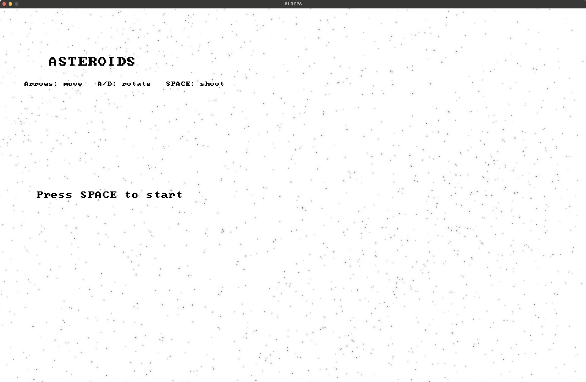
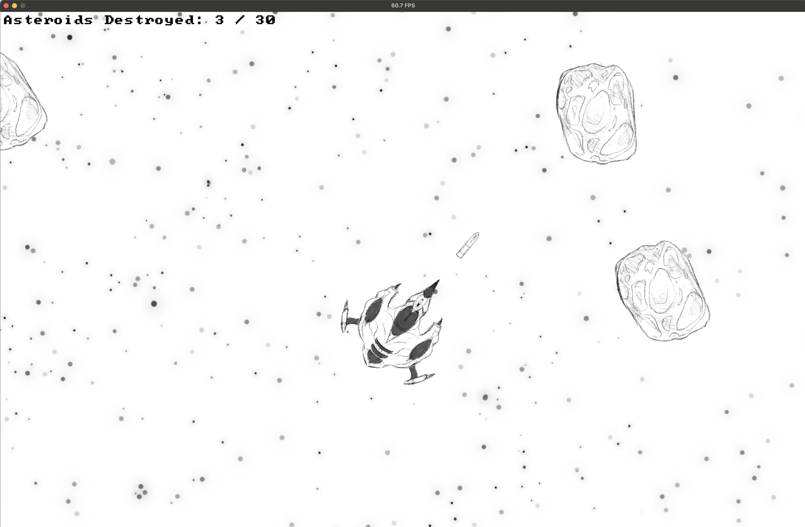
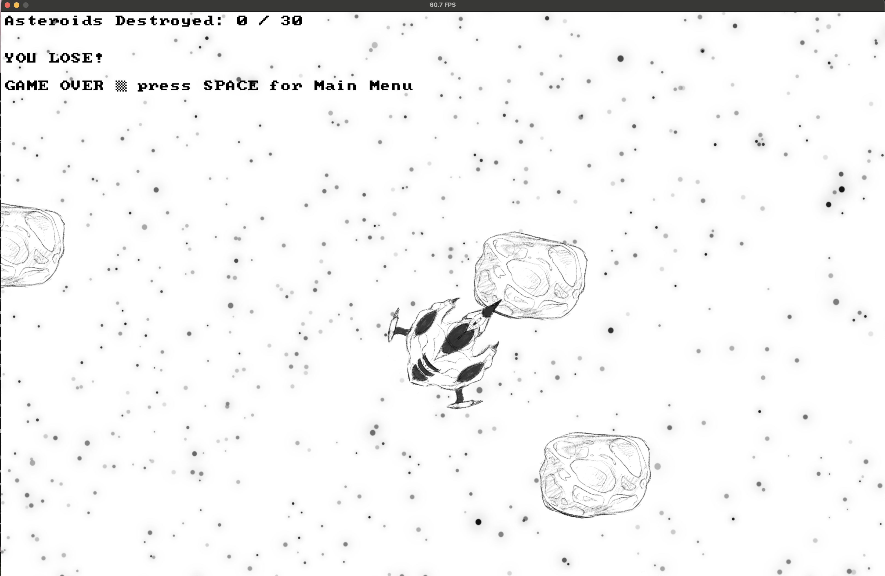

# Asteroids!

This is my attempt at recreating the classic 1979 game *Asteroids*. All art was drawn by me !

---

## Game Preview

### Main Menu


### Game Play


### Game Over


---

## Features

- **60 FPS engine** with frame-cap and delta-time movement  
- **Scene system & Scene Tree** (Main Menu, Level 1, and Game Over) for switching out levels instantly
- **Resource Manager** for images, sprite sheets, sounds, and fonts    
- **Large scrolling world** with a **camera that follows the ship**  
- **User Input**: to rotate the ship, move around, and fire projectiles  
- **Free-floating asteroids** that end the game upon impact with the ship and disapear when hit by a projectile
- **Score display** & **sound effect** upon firing projectiles

---

## Controls

- **Arrow keys** — Move ship around the map
- **A / D** — Rotate the ship
- **Space** — Fire projectiles

---

## Running the game

To run the game, simply type 'dub' in your terminal at the project root:

```bash
dub
```

The game looks for a default resources configuration (`resources.json`) in the repo root to start.

---

## Project Layout

```
/source             # D source (engine + game code)
/assets             # Images, sprite sheets, audio, fonts, GIFs
dub.json            # help run everything
dub.selections.json
resources.json      # default configuration
README.md
```

*Note: assets have been excluded due to the size of the files.*

---

